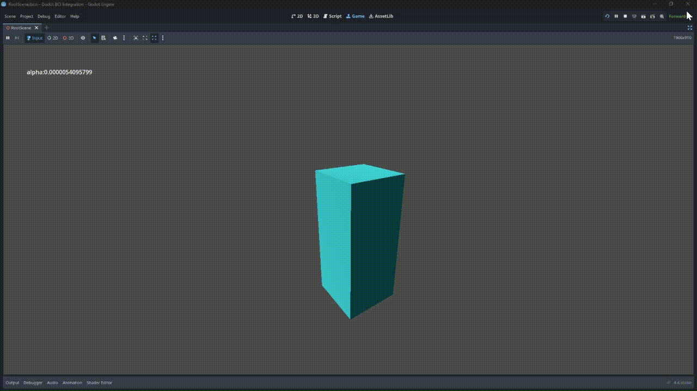

# godot-bci-prototype
* Godot Integration With BCI (Prototype WIP)
* Built by and MD-turned-Dev, exploring low-cost BCI for XR.

# Why?
* Can be used in VR projects to help rehabilitation after orthopedic surgery or traumatic events.
* In-game mechanics to trigger an event or record the player's brain activity (VR or 2D/3D).

# Brain-Computer Interface Demo - Godot 4.x and Python
* Streamed real EEG alpha rhythm (PhysioNet) over async WebSocket to a Godot 3D scene, scaling 3D object (a Cube) in real time.

# Technical Info:
* To get data from PhysioNet: "mne.datasets.eegbci.load_data(2,[4])"
* Stack: MNE-Python, Butterworth filter, asyncio, GDScript
* 120 fps desktop preview; code + video demo (.gif)

# How to Run:
1. Run the python file (StreamerEEGtoGodot.py)
2. When server is running, hit "Play" in the Godot editor (open godot-project in editor)
3. Wait for the game to connect, and then see the changes in scale of the cube.

# Demo:

This demo project is publicly available under MIT license.

Copyright (c) 2025 Your Name (nerveinvader@github)
