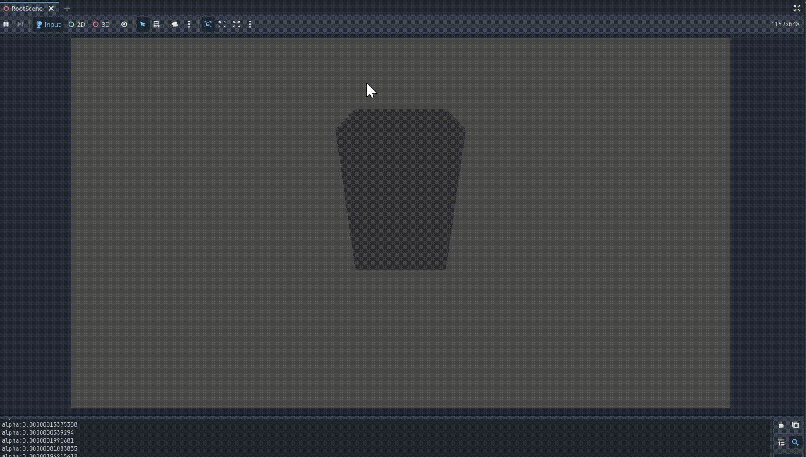

# godot-bci-prototype
Godot Integration With BCI (Prototype WIP)

# Brain-Commputer Interface Demo - Godot 4.x and Python
* Streamed real EEG alpha rhythm (PhysioNet) over async WebSocket to a Godot 3D scene, scaling 3D object (a Cube) in real time.
* Stack: MNE-Python, Butterworth filter, asyncio, GDScript
* 120 fps desktop preview; code + video demo (.gif)

# How to Run:
1. Run the python file (StreamerEEGtoGodot.py)
2. When server is running, Play the Godot project (open godot-project in editor)
3. Wait for the game to connect, and then see the changes in scale of the cube.

# Demo:

This demo project is publicly available under MIT license.

Copyright (c) 2025 Your Name (nerveinvader@github)
